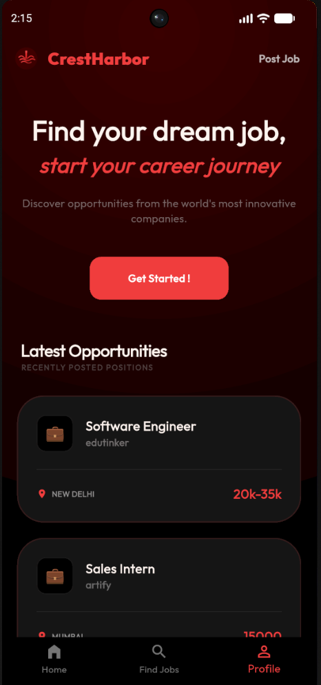
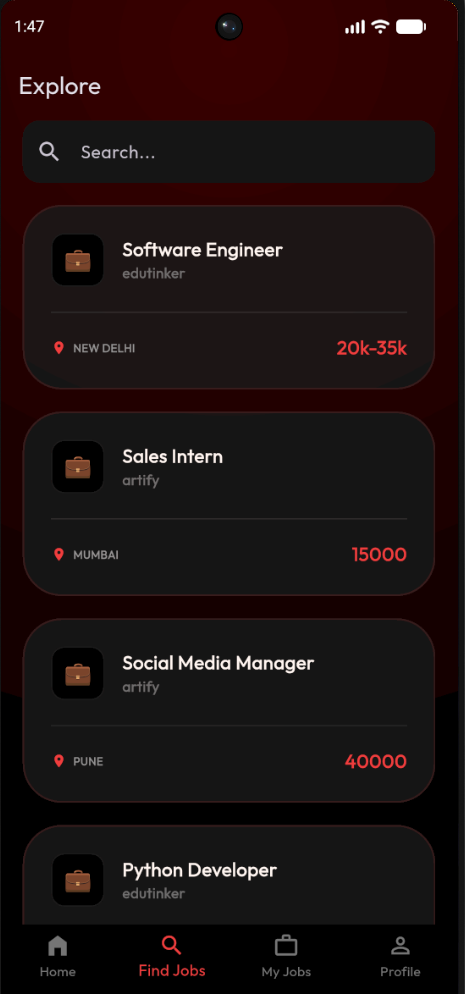
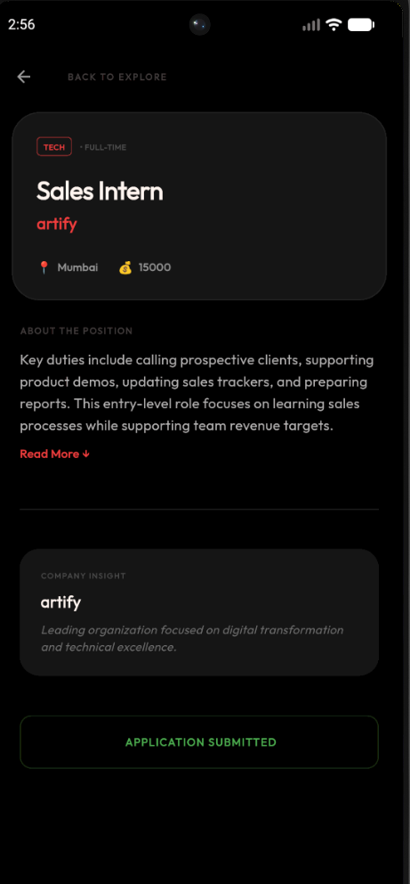
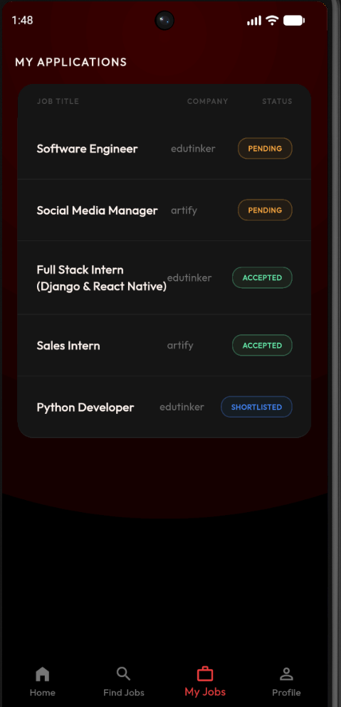
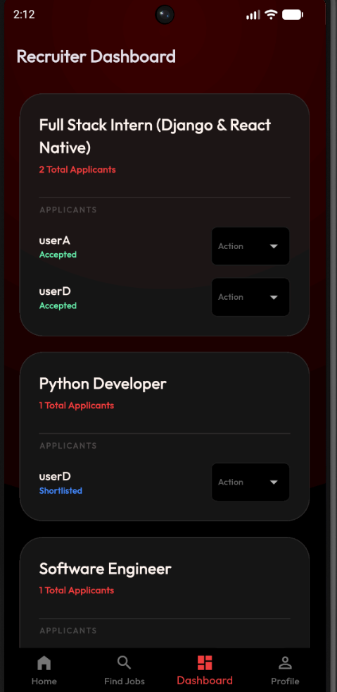
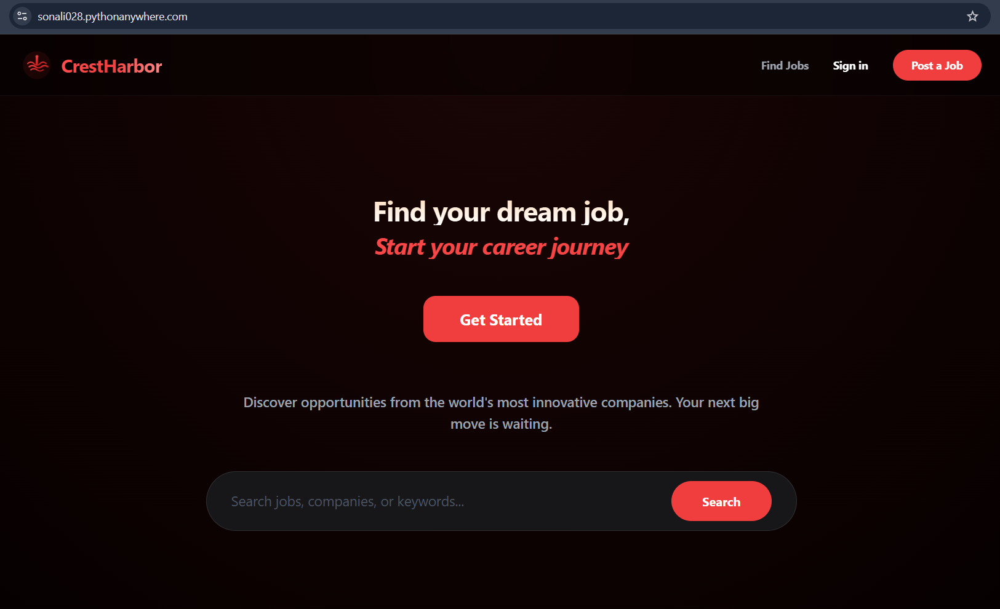
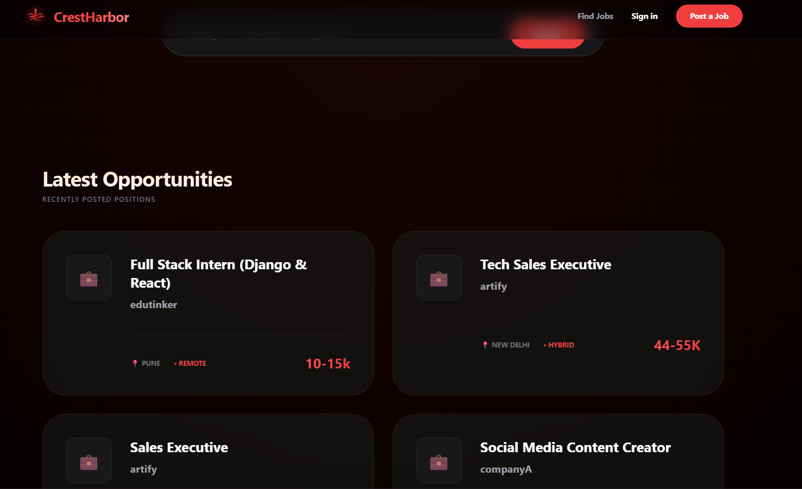
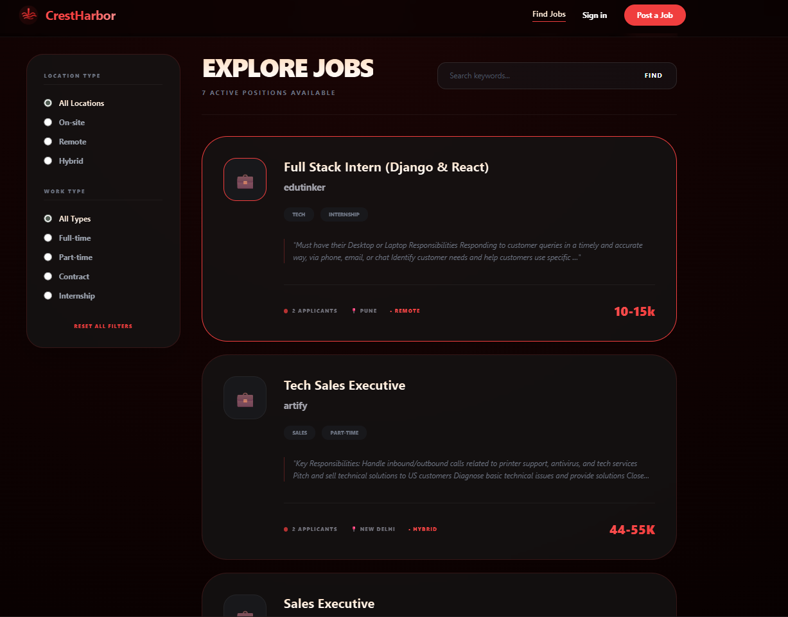
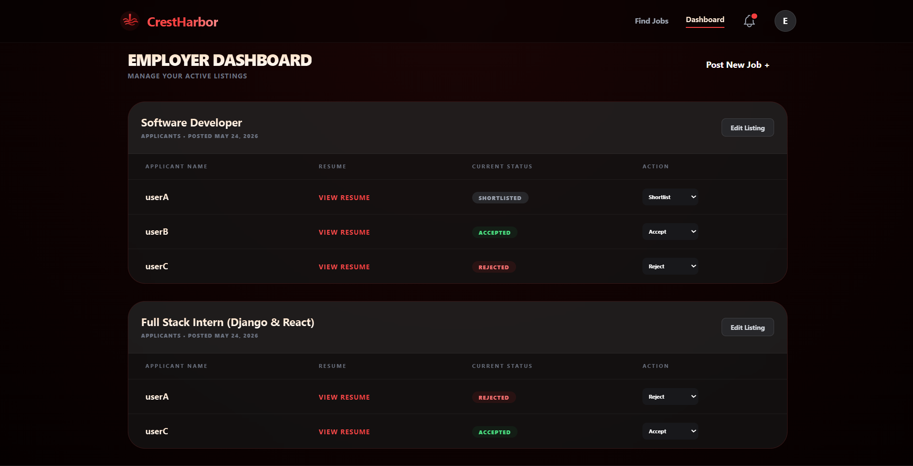

# CrestHarbor | Full-Stack Recruitment Ecosystem

**CrestHarbor** is a cross-platform job board designed for modern web and mobile environments. By utilizing a **Headless Django Architecture**, the platform maintains data parity between its responsive web client and its native Flutter mobile application, serving users through a unified REST API.

##  Production Environment
* **Live Web Deployment:** [https://sonali028.pythonanywhere.com/](https://sonali028.pythonanywhere.com/)
* **Mobile Client:** Android/iOS (Native Flutter)
* **Android Demo:** [Download CrestHarbor APK](https://github.com/sun0028/CrestHarbor/raw/main/release/app-release.apk)
* **API Status:** RESTful JWT Authentication Live

---

##  Mobile Application Showcase (Flutter)
*The native mobile app replicates the web ecosystem with optimized touch-gestures and stateful navigation.*


**Home Screen:**
<p align="center">
  
</p>

**Find Jobs Screen:**
<p align="center">
 
  </p>
  
**My Jobs Screen:**
<p align="center">
 
 </p>

**Employer's Dashboard Screen:**
<p align="center">
  
</p>

---

##  Web Interface Showcase (Django)
 **Home page:**
<p align="center">
  
  <br>
</p>
  
**Find Jobs page:**
<p align="center">
  
</p>

**Employer's Dashboard**
<p align="center">
  
</p>

---

##  Technical Architecture & Key Features

### 1. Headless Backend & Unified API
* **Technology:** Django 5.x + Django REST Framework (DRF).
* **Functionality:** Engineered a centralized engine that serves raw JSON data to the mobile client via **JWT (JSON Web Tokens)** while simultaneously rendering SSR templates for the web.
* **Data Integrity:** Real-time synchronization ensuring that actions taken on mobile (e.g., updating an application status) trigger state changes and notifications across all platforms.

### 2. Authentication & Role-Based Access
* **Custom User Model:** Implemented an `AbstractUser` architecture to handle distinct entity roles (Employers vs. Job Seekers) with strictly gated permissions.
* **Mobile Security:** Secured cross-platform communication with encrypted token-based sessions and `SharedPreferences` for local session persistence.

### 3. UI/UX Implementation
* **Web Design:** Matte Dark interface utilizing mahogany radial gradients and glassmorphism components.
* **Mobile Design:** High-fidelity mobile UI featuring Dynamic Radial Gradients with **glassmorphism components** and matte-finished cards optimized for mobile GPU rendering.
* **Typography:** Unified **Segoe UI** design system for consistent aesthetics across web and mobile.
* **Feedback Systems:** Integrated a "Red Dot" notification system and dynamic status tracking (Shortlisted, Accepted, Rejected).

### 4. Search & Query Optimization
* **Filtering Engine:** Utilized Django `Q` objects for complex `AND/OR` queries across Keywords, Geography, and Work-Type.
* **Database Efficiency:** Leveraged `annotate()` and `Count` aggregations to deliver real-time applicant metrics.
* **Mobile UX:**  Implemented Expandable Text Logic (Read More/Less) on mobile to maintain clean visual hierarchy on smaller viewports.

---

##  Technology Stack
* **Backend:** Python 3.13, Django 5.x, SQLite.
* **Mobile:** Flutter SDK, Dart, HTTP/JSON, SharedPreferences, Image Pcker.
* **Frontend:** Tailwind CSS, JavaScript (ES6+), Segoe UI Typography.
* **Operations:** WSGI Configuration, WhiteNoise, Cloud Deployment via PythonAnywhere.

---

##  Monorepo Structure
```text
CrestHarbor/
├── core/                # System configuration & WSGI entry points
├── jobs/                # Core Business Logic (Models, Views, API)
├── crestharborapp/      # Flutter Mobile Application Source
├── media/               # Unified Visual Assets (Web & Mobile)
├── static/              # Web Design Assets (Matte Red Theme)
└── templates/           # Web Component Architecture